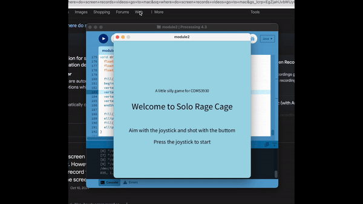

# Coms3930-module2: Iterative devices

**About**:
This page is dedicated to Module 2: Iterative devices. My project is a solo version of the drinking game Rage Cage. Visit my process blog: https://www.notion.so/Module-2-Solo-rage-cage-128bf6a5ae3080b8b3cec4ad772350d6.

 

**Project Title:** Solo Rage Cage 

**Description:** This project reimagines the popular drinking game Rage Cage as a single-player interactive experience. The player begins by pressing the joystick to start, aims using the joystick, adjusts the power with the potentiometer, and shoots with the button. All components are housed within 3D-printed enclosures.

**Components Needed:** Lily TTGO esp32, joystick, potentiometer, buttom, cable 

**Repo content:** 
- Code loaded in Arduido IDE to read the inputs and communicate with Processing;
- The Java code to be loaded in to Processing;
- STL files used to 3D print;
- Fritzing diagram file;

  

